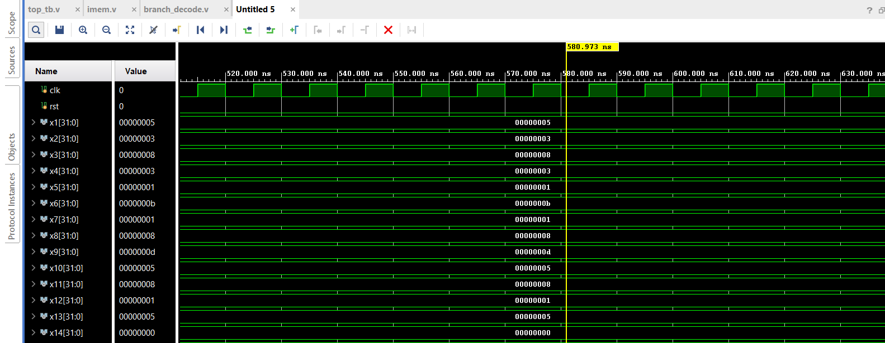
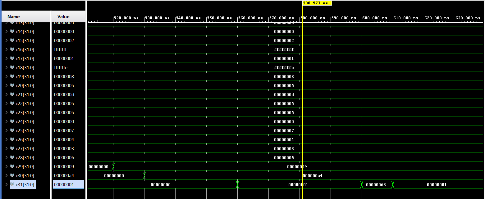

# RISC-V Pipelined Processor

A RISC-V pipelined processor ,following the RV32I instruction set .The project follows the design given in Digital Design and Computer Architecture by Harris and Harris as reference .

## Architecture

5-stage pipeline: Instruction Fetch(IF) → Instruction Decode(ID) → Execute(EX) → Memory Access(MEM) → Writeback(WB)

## Instructions Implemented and Verified

| Type | Instructions |
|------|-------------|
| R-type | add, sub, and, or, slt |
| I-type | addi, andi, ori, slti, lw, jalr|
| S-type | sw |
| B-type | beq, bne, blt, bge |
| J-type | jal |

## Hazard Handling

- Load-use stall (1 cycle)
- EX/MEM and MEM/WB forwarding
- Branch flush (predict not-taken, flush on taken)
- Jump flush

## Modules

| Module | Description |
|--------|-------------|
| `pc` | Program counter |
| `imem` | Instruction memory |
| `dmem` | Data memory |
| `if_id` | IF/ID pipeline register |
| `id_ex` | ID/EX pipeline register |
| `ex_mem` | EX/MEM pipeline register |
| `mem_wb` | MEM/WB pipeline register |
| `regFile` | Register file (negedge write, combinational read) |
| `alu` | Arithmetic logic unit |
| `control_signal` | Control unit |
| `immExtend` | Immediate extension |
| `branch_decode` | Branch/jump target and taken logic |
| `hazard_unit` | Forwarding, stall, and flush control |
| `mux2_1`, `mux3_1` | Multiplexers |
| `top` | Full pipeline integration |

## Simulation Results
- Obtained after running the given tests.hex code (machine code of tests_assembly.s)

## To Be Implemented

- Remaining branches: bltu, bgeu
- Upper immediate: lui, auipc
- Remaining loads/stores: lb, lh, lbu, lhu, sb, sh
- Shifts: sll, srl, sra, slli, srli, srai
- xor, xori

## Reference

Harris, S. & Harris, D. — *Digital Design and Computer Architecture: RISC-V Edition*
